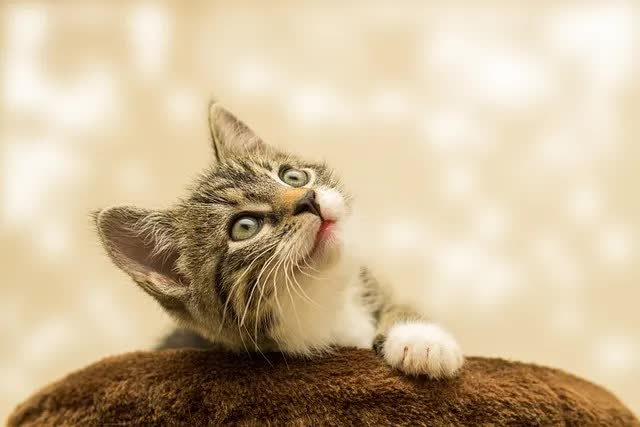
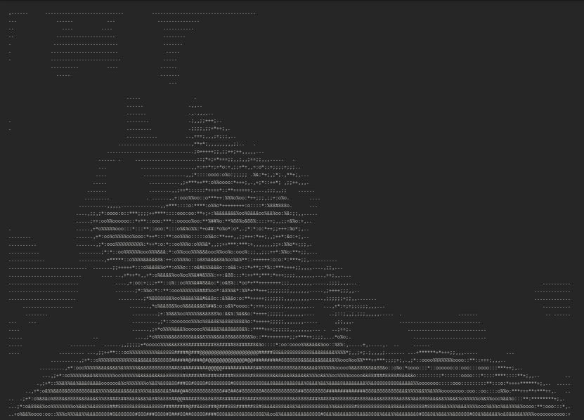

# ASCII Art Generator

A Python script that converts images into ASCII art by mapping pixel intensities to ASCII characters. The program takes an image as input and generates a text file containing the ASCII representation of that image.

## Features

- Converts images to grayscale ASCII art
- Maintains aspect ratio during conversion
- Configurable output width and character set
- Saves output to a text file

## Prerequisites

- Python 3.x
- Pillow (PIL) library

## Installation

1. Clone this repository or download the source code
2. Install the required dependencies:
```bash
pip install Pillow
```

## Project Structure

```
ascii-art-generator/
│
├── main.py           # Main script
├── images/          # Directory for input images
│   └── sample.jpg   # Sample image
└── art.txt          # Generated ASCII art output
```

## Usage

1. Place your input image in the `images` directory
2. Update the `img_name` variable in `main.py` if using a different image
3. Run the script:
```bash
python main.py
```
4. The ASCII art will be saved in `art.txt`

## How It Works

1. `resize_img()`: Resizes the input image while maintaining aspect ratio
2. `get_pixels()`: Converts the image to grayscale and extracts pixel values
3. `map_pixels()`: Maps pixel intensities to ASCII characters
4. `format_art()`: Formats the ASCII characters into lines of text

## Customization

You can modify these variables in the script:
- `ASCII`: List of characters used for the ASCII art (from darkest to lightest)
- `new_width`: Default width of the output ASCII art (default: 200 characters)
- `correction`: Aspect ratio correction factor (default: 2.5)

## Example

Input:  



Output:  



